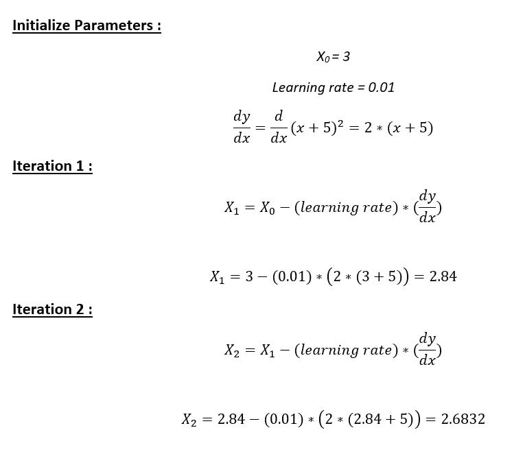
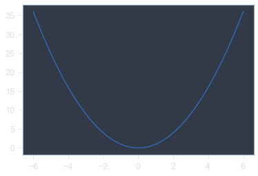
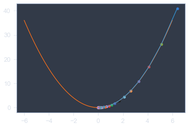

# Machine-Learning-ML-
Basic ML algorithm implementation in python

**Intitution :**

Thnik about a ball that rolling down from a hill, what will be it's behaviour?

It will take the lowest path until  it comes to the lowest point of the hill that is the palne

**Gradient decent** also works like this it starts from a point(Starting point) and take the path that have lower gradient 

Now the question is how it will determine what will be it's Step size and how it will determine ....it have reached to it's goal

so the algo introduced **learning rate(ª)** it will  give the step size 
and to converge the algo **Precision** and **Max Iteration** is given 

**Note :** don't use too small learing rate then it will converge too slowly or if you use too large L.R  then there is a chance it will not converge at all

# Process :

**Step 1 :** Initialize <math>x =7.</math> of fuction<math> y=x^2</math> Then, find the gradient of the function,<math> dy/dx = 2*x.</math>

**Step 2 :** Move in the direction of the lower of the gradient . **But wait,** how much to move? For that, we require a learning rate. 
Let us assume the learning rate → 0.2

**Step 3** After  every iteration (after moving each step) check whether it reaches to local minimum or not 

**The plot of our fuction**

**After useing Gradient Decent**

# Output
Iteration 1 value is 6.4
Iteration 2 value is 5.12
Iteration 3 value is 4.096
Iteration 4 value is 3.2768
Iteration 5 value is 2.62144
Iteration 6 value is 2.0971520000000003
Iteration 7 value is 1.6777216000000004
Iteration 8 value is 1.3421772800000003
Iteration 9 value is 1.0737418240000003
Iteration 10 value is 0.8589934592000003
Iteration 11 value is 0.6871947673600002
Iteration 12 value is 0.5497558138880001
Iteration 13 value is 0.43980465111040007
Iteration 14 value is 0.35184372088832006
Iteration 15 value is 0.281474976710656
Iteration 16 value is 0.22517998136852482
Iteration 17 value is 0.18014398509481985
Iteration 18 value is 0.14411518807585588
Iteration 19 value is 0.11529215046068471
Iteration 20 value is 0.09223372036854777
Iteration 21 value is 0.07378697629483821
Iteration 22 value is 0.05902958103587057
Iteration 23 value is 0.04722366482869646
Iteration 24 value is 0.037778931862957166
Iteration 25 value is 0.030223145490365734
Iteration 26 value is 0.024178516392292588
Iteration 27 value is 0.01934281311383407
Iteration 28 value is 0.015474250491067256
Iteration 29 value is 0.012379400392853806
Iteration 30 value is 0.009903520314283045
Iteration 31 value is 0.007922816251426436
Iteration 32 value is 0.006338253001141149
Iteration 33 value is 0.00507060240091292
Iteration 34 value is 0.0040564819207303355
Iteration 35 value is 0.0032451855365842686
Iteration 36 value is 0.002596148429267415
Iteration 37 value is 0.002076918743413932
Iteration 38 value is 0.0016615349947311456
Iteration 39 value is 0.0013292279957849164
Iteration 40 value is 0.001063382396627933
Iteration 41 value is 0.0008507059173023465
Iteration 42 value is 0.0006805647338418772
Iteration 43 value is 0.0005444517870735017
Iteration 44 value is 0.0004355614296588014
Iteration 45 value is 0.0003484491437270411
Iteration 46 value is 0.00027875931498163285
Iteration 47 value is 0.00022300745198530628
Iteration 48 value is 0.00017840596158824503
Iteration 49 value is 0.00014272476927059603
Iteration 50 value is 0.00011417981541647683
Iteration 51 value is 9.134385233318146e-05
Iteration 52 value is 7.307508186654517e-05
Iteration 53 value is 5.846006549323614e-05
Iteration 54 value is 4.676805239458891e-05
Iteration 55 value is 3.741444191567113e-05
local mninimum occurs at 3.741444191567113e-05

